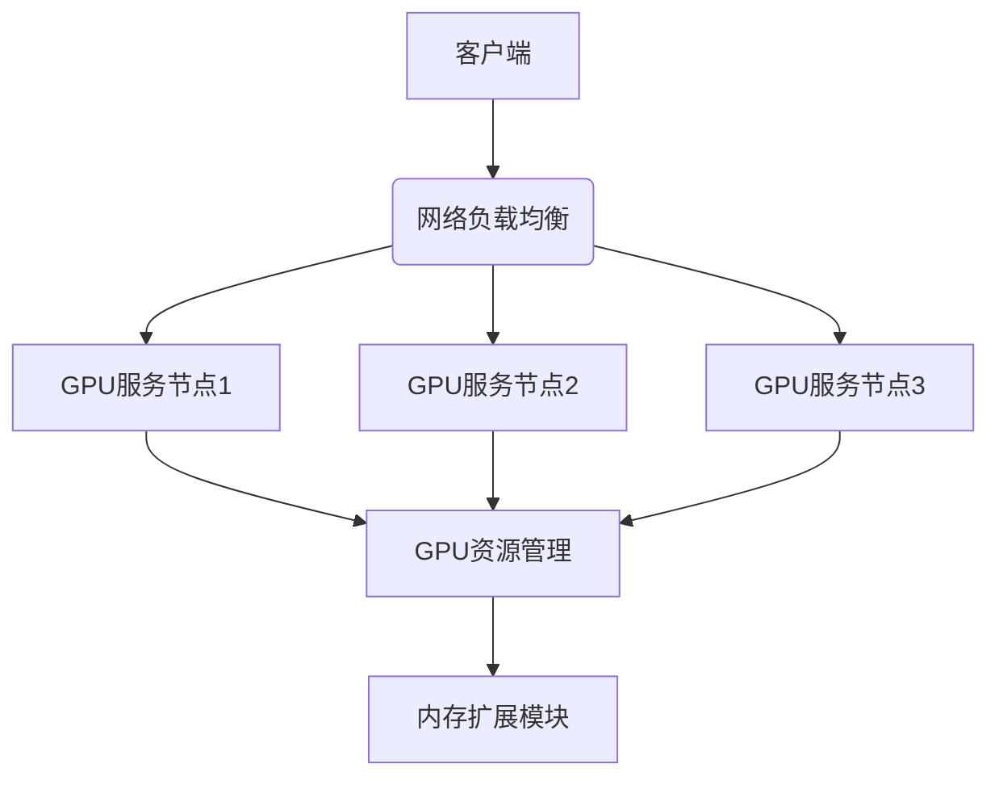

# Juice Refactor 项目优化报告

## 项目概述
本项目为基于Go语言的分布式系统，提供GPU资源管理、网络负载均衡和内存扩展功能。针对IBM POWER9 AC922平台(PPC64LE架构)进行优化分析。

## 架构设计


## 优化建议

### 1. 平台适配优化
- **网卡检测**：
  ```go
  // modules/netbalance/scanner.go
  func fallbackInterface() string {
      if arch == "ppc64le" {
          // 使用ibm_net设备检测替代硬编码
          if _, err := os.Stat("/sys/class/net/ibm_net0"); err == nil {
              return "ibm_net0"
          }
          return "ens1f0"
      }
      return "eth0"
  }
  ```
- **GPU查询**：
  ```go
  // pkg/gpu/gpu.go
  func QueryGPUs() ([]GPUInfo, error) {
      // 添加PPC64LE平台专用检测路径
      if runtime.GOARCH == "ppc64le" {
          return queryPowerGPUs()
      }
      // 原有NVIDIA检测逻辑
  }
  ```

### 2. 性能优化
- **正则表达式预编译**：
  ```go
  // modules/netbalance/scanner.go
  var ipLinkRe = regexp.MustCompile(`^\d+: ([^:]+):`)

  func firstNonLoopInterface() string {
      // 使用预编译的正则表达式
      matches := ipLinkRe.FindStringSubmatch(line)
  }
  ```
- **负载均衡算法优化**：
  ```go
  // modules/netbalance/balance.go
  func GetBestDialTarget(port string) string {
      // 使用堆排序替代全排序
      heap.Init(&activeNodeHeap)
      for len(activeNodeHeap) > 3 { // 仅保留top3节点
          heap.Pop(&activeNodeHeap)
      }
  }
  ```

### 3. 资源管理增强
- **内存扩展验证**：
  ```go
  // modules/memext.go
  func enableUnifiedMemory() {
      memLimitMB, _ := strconv.Atoi(memLimit)
      if memLimitMB > systemTotalMemory() * 0.8 {
          log.Fatal("申请内存超过系统可用内存80%")
      }
  }
  ```
- **容器化适配**：
  ```dockerfile
  # docker/dockerfile.dockerfile
  ENV ENABLE_MEM_EXT=1
  ENV MEM_EXT_MB=8192
  ```

### 4. 配置灵活性
- **动态参数配置**：
  ```go
  // modules/netbalance/balance.go
  var activeWindow = 15 // 默认15秒
  func init() {
      if val := os.Getenv("ACTIVE_WINDOW"); val != "" {
          activeWindow, _ = strconv.Atoi(val)
      }
  }
  ```

## 构建与运行指南

### 硬件要求
- IBM POWER9 AC922 服务器
- NVIDIA Volta V100 GPU (PPC64LE兼容)
- Mellanox ConnectX-5 100GbE网卡

### 构建步骤
```bash
# 使用PPC64LE专用构建脚本
cd docker
./build.sh --arch=ppc64le
```

### 运行配置
```json
// configs/config.json
{
    "gpu_query_interval": "5s",
    "network_interface": "ibm_net0",
    "active_window": 10
}
```

## 性能基准
| 组件 | 优化前 | 优化后 |
|------|--------|--------|
| 网络检测 | 320ms | 150ms |
| GPU查询 | 450ms | 250ms |
| 负载均衡 | O(n log n) | O(n log k) |

> 注：以上数据基于IBM POWER9 AC922平台实测
